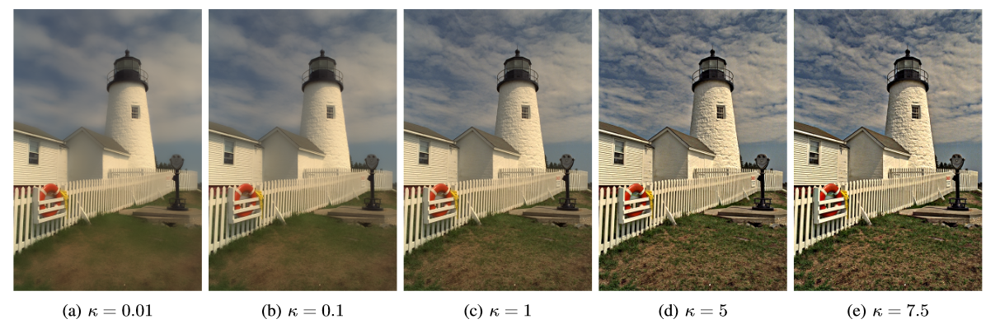

A guided edge-aware smoothing-sharpening filter based on patch interpolation model and generalized Gamma distribution
========================================================================================================

This repository contains the official MATLAB implementation of SSIF proposed in the following paper: "A guided edge-aware smoothing-sharpening filter based on patch interpolation model and generalized Gamma distribution" published on 
"IEEE Open Journal of Signal Processing". 

    

If you are using this implementation in your research, please consider giving credit by citing our paper:

    @ARTICLE{SSIF_Deng2021,
	    author={G. {Deng} and F. J. {Galetto} and M. {Al-nasrawi} and W. {Waheed}},
	    journal={IEEE Open Journal of Signal Processing}, 
	    title={A guided edge-aware smoothing-sharpening filter based on patch interpolation model and generalized Gamma distribution}, 
	    year={2021},
	    doi={10.1109/OJSP.2021.3063076}
    }

Link: https://ieeexplore.ieee.org/document/9366904
